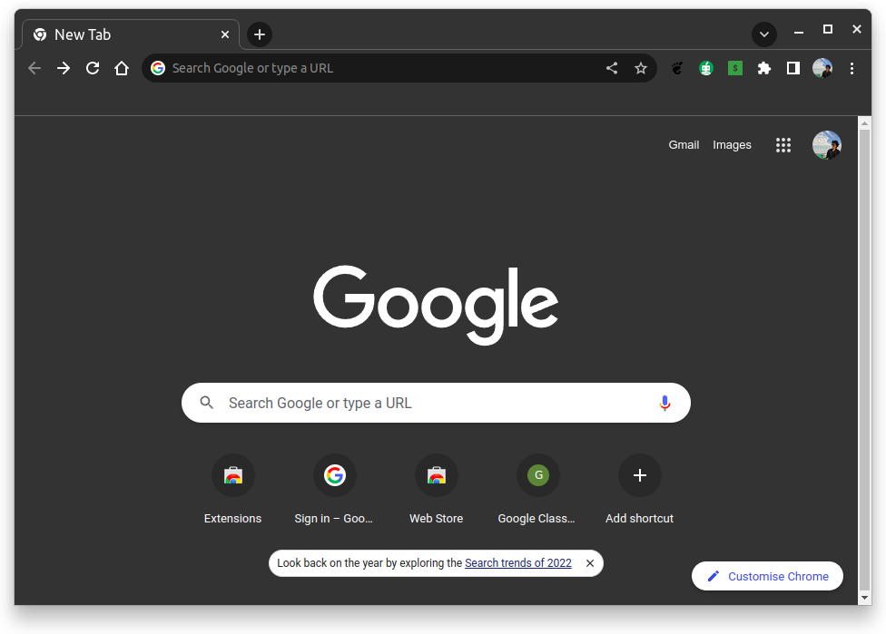
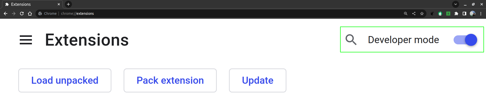
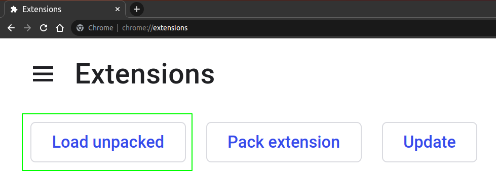
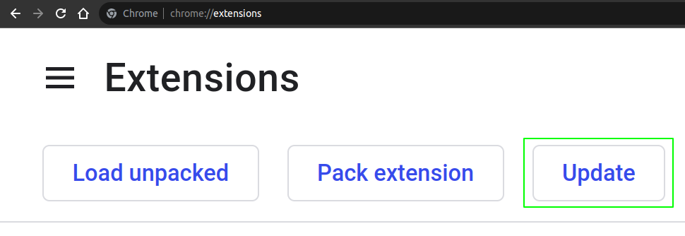
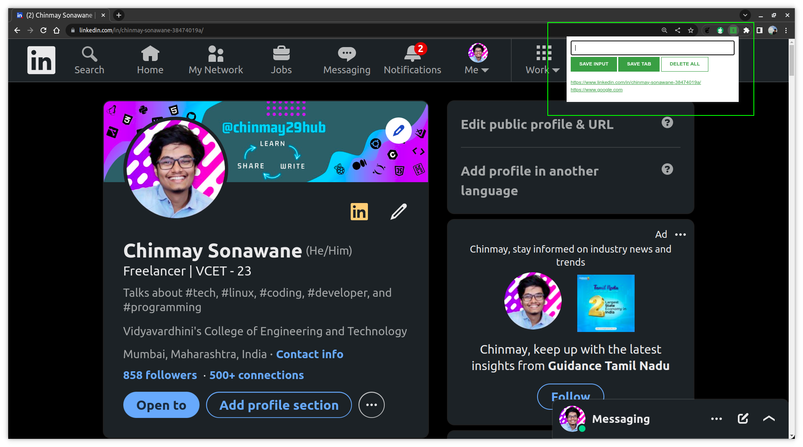

# learn-javascript

### Passenger Counter App : [Live Demo](https://chinmay29hub.github.io/learn-javascript/1.%20Build%20a%20Passenger%20Counter%20App/28.%20Congrats%20&%20recap/)

### BlackJacl Game : [Live Demo](https://chinmay29hub.github.io/learn-javascript/3.%20Build%20a%20Blackjack%20game/54.%20Congrats%20&%20recap/)

### Lead Tracker (A Chrome Extension)

To install this extension, follow the steps below:

1. Download the zip file from the repository or [Click Here](https://github.com/chinmay29hub/learn-javascript/raw/5947dec48d062d77a71c8370efead8b002298277/lead_tracker.zip)
2. Extract the zip file.
3. Open the Chrome browser.
   
 

 

1. Type `chrome://extensions` in the address bar.
2. Enable the `Developer Mode` on the top right corner.

 

 

6. Click on `Load Unpacked` and select the extracted folder.

 

 

7. The extension is now installed. You can see it in the extensions list.
8. If you are unable to see the extension, click on the `Details` button and then click on the `Extension options` button. And update the extension.

 

 

9. The extension is now installed. You can see it in the extensions list.
    
 

 
  
10.  To remove the extension, click on the `Remove` button.